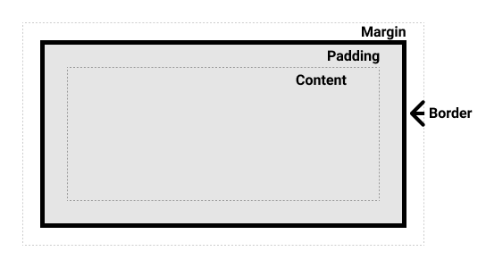

# Topic: The Box Model

## link: https://www.theodinproject.com/lessons/foundations-the-box-model

## What is the box model

### The Box Model
Every single thing on a webpage is a rectangular box. These boxes can have other boxes in them and can sit alongside one another. 

If we do:

```
* {
    outline: 2px solid red
}
```

we can see the outline of every box in out web page. In the end the laying out of the boxes on a webpage and positioning all its elements is deciding how you are going to nest and stack these boxes.

We can manipulate the size of these boxes and the space between them using padding, margin and border.

```padding``` increases the space between the border of a box and the content of the box.

```margin``` increases the space between the borders of a box and the borders of adjacent boxes.

```border``` adds space (even if it’s only a pixel or two) between the margin and the padding.


## How to make sure elements are just the right size with margin, padding, and borders

### The Standard CSS 
The CSS box model as a whole applies to block boxes and defines how the different parts of a box — margin, border, padding, and content — work together to create a box that you can see on a page. Inline boxes use just some of the behavior defined in the box model.

To add complexity, there is a standard and an alternate box model. By default, browsers use the standard box model:

- Content box: The area where your content is displayed; size it using properties like inline-size and block-size or width and height.
- Padding box: The padding sits around the content as white space; size it using padding and related properties.
- Border box: The border box wraps the content and any padding; size it using border and related properties.
- Margin box: The margin is the outermost layer, wrapping the content, padding, and border as whitespace between this box and other elements; size it using margin and related properties.




### The alternative CSS box model
In the alternative box model, any width is the width of the visible box on the page. The content area width is that width minus the width for the padding and border (see image below). No need to add up the border and padding to get the real size of the box.

Now, the actual space taken up by the box will be 350px in the inline direction and 150px in the block direction.


To use the alternative box model for all of your elements (which is a common choice among developers), set the box-sizing property on the <html> element and set all other elements to inherit that value:

```
html {
  box-sizing: border-box;
}

*,
*::before,
*::after {
  box-sizing: inherit;
}
```

## Notes:
- In standard css or alternative css margin is not count
- In standard css padding and border al sum to the total size of the box, this influence the total size of the box.
- The alternative box model use "box-sizing: border-box;", so the total size subtract from the contentBox the padding and border values. - The total of content,padding and border will be the same as width and height. Very helpful at the long run.


