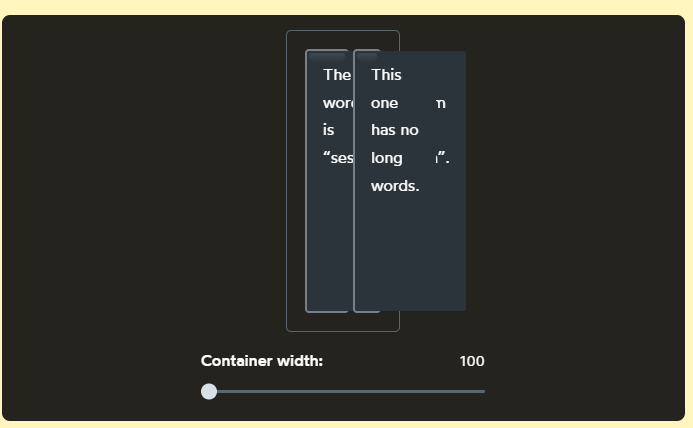

# Topic: Alignment

## [TOP/Foundations/CSS/Flexbox/Alignment](https://www.theodinproject.com/lessons/foundations-alignment)

## justify-content

works in the main axis as horizontal if row, and vertical if column.

## Align-items

works in the cross axis, as vertical if row, horizontal if column.

### Notes

- Generally, justify-content and Align-items are used in the container.
- If we need more granular, we use justify-self or align-self for the childs. In a particular item to separate from the others.
- If the item is a container too, we need to declare the display: flex on it.

## Gap

`gap` adds a specified space between flex items, similar to adding a margin to the items themselves.

ex:

```css
gap: 8px;
```

## Knowledge check

- ### What is the difference between justify-content and align-items?

  - Justify-content work in the main axis and align-items work in the cross axis.
  - They interchange places only if the flex-direction change from row to column.
  - Both are used in mostly in the container to arrange the items.

- ### How do you use flexbox to completely center a div inside a flex container?

Using a combination of justify-content and align-items if only one.
if we need a single div we need to add a class and use in a justify-self and align-self to correctly place it in the center.

- ### What’s the difference between `justify-content: space-between` and `justify-content: space-around`?

the values of:
`space-between`: distribute the free space only between the items, not leaving free space in the in the start and end gaps.

`space-around`: distribute the free space around all the items but the start and end gaps are half the between size.

`space-evenly`: between and start / end gaps are equal size.

primary axis is like a kebab and cross axis are cocktail wieners


With all of this context in mind, let's give a proper definition to all 4 terms we've been talking about:

- justify — to position something along the primary axis.
- align — to position something along the cross axis.
- content — a group of “stuff” that can be distributed.
- items — single items that can be positioned individually.

There is a align-content but it works with flex-wrap property.

In Flexbox, however, the width property is implemented differently. It's more of a suggestion than a hard constraint.

The specification has a name for this: the hypothetical size. It's the size an element would be, in a perfect utopian world, with nothing getting in the way.

Alas, things are rarely so simple. In this case, the limiting factor is that the parent doesn't have room for a 2000px-wide child. And so, the child's size is reduced so that it fits.

This is a core part of the Flexbox philosophy. Things are fluid and flexible and can adjust to the constraints of the world.

## Inputs for the algorithms

We tend to think of the CSS language as a collection of properties, but I think that's the wrong mental model. As we've seen, the width property behaves differently depending on the layout mode used!

Instead, I like to think of CSS as a collection of layout modes. Each layout mode is an algorithm that can implement or redefine each CSS property. We provide an algorithm with our CSS declarations (key/value pairs), and the algorithm decides how to use them.

In other words, the CSS we write is an input for these algorithms, like arguments passed to a function. If we want to truly feel comfortable with CSS, it's not enough to learn the properties; we have to learn how the algorithms use these properties.

This is the central philosophy taken by my course, CSS for JavaScript Developers. Rather than have you memorize a bunch of inscrutable CSS snippets, we pop the hood on the language and learn how all of the layout modes work.

if we want to leave certain items from shinkring, we can set flex-shrink to 0

for flex-shrink is all about the ratio we define, that is gonna be pay and who is gonna pay more to cover the deficit.

So to have the correct idea in mind:

`flex-grow` controls how the extra space is distributed when the items are smaller than their container.

`flex-shrink` controls how space is removed when the items are bigger than their container.

only one property can be active at one time.

Need to treat them as two different realms.

We can use flex-shrink for a more suggested rate instead of a hardcode one.

## The minimum size

In addition to the hypothetical size, there's another important size that the Flexbox algorithm cares about: the minimum size.
The Flexbox algorithm refuses to shrink a child below its minimum size. The content will overflow rather than shrink further, no matter how high we crank flex-shrink

### text inputs

Text inputs have a default minimum size of 170px-200px (it varies between browsers). That's the limitation we're running into above.

### element's content

in other cases the limiting factor might be the element's content. For an element containing text, the minimum width is the length of the longest unbreakable string of characters.

A way to solve this issue is using min-width

### min-width

min-width by default is auto, creating the problem of overflowing the container.

By setting min-width: 0px directly on the Flex child, we tell the Flexbox algorithm to overwrite the “built-in” minimum width. Because we've set it to 0px, the element can shrink as much as necessary.

This same trick can work in Flex columns with the min-height property (although the problem doesn't seem to come up as often).

It's worth noting that the built-in minimum size does serve a purpose. It's meant to act as a guardrail, to prevent something even worse from happening.

For example: when we apply min-width: 0px to our text-containing Flex children, things break in an even worse way



So we need to use this trick with care.

### gaps

`gap` allows us to create space in-between each Flex child. This is great for things like navigation headers

This way we don´t need to use margin to create space.

### margin: auto

it can be used to center an specific element, in some layaout modes.

`flex-grow` property can gobble up any extra space applying it to a child.
`margin: auto` (left/right or both) will gobble up the extra space, and apply it to the elements's margin. It give us precise control over where to distribute the extra space.

depending of with side with use, is like placing an invisible separator that will auto adjust.

### Wrapping flex-wrap

- `flex-wrap` by default is has the value of nowrap.
- flexbox is one-dimensional
- CSS grid is two-dimensional
- with flex-wrap, Each row is its own mini flexbox environment align-items will move each item up or down within the invisible box that wraps around each row.
- If we want to align the rows themselves, we can do it with align-content property.
- flex-wrap: wrap give us two rows of stuff.
- Within each row, align items, let us slide each individual child up or down.
- Zooming out, however, we have these two rows within a single Flex context! The cross axis will now intersect two rows, not one. And so, we can't move the rows individually, we need to distribute them as a group.
- Using our definitions from above, we're dealing with content, not items. But we're also still talking about the cross axis! And so the property we want is `align-content`.


