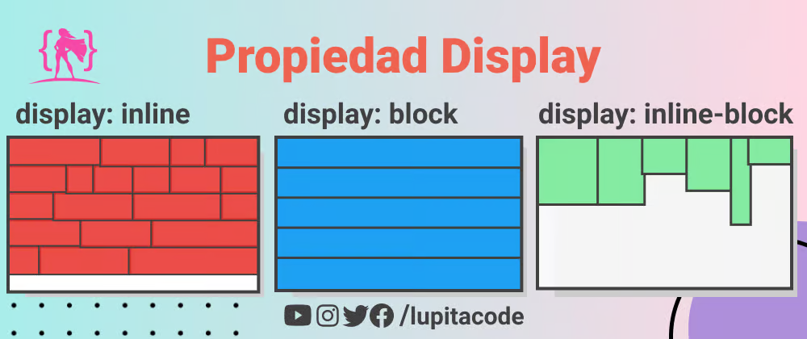
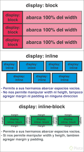

# Topic: Block and Inline
## link: https://www.theodinproject.com/lessons/foundations-block-and-inline

## Normal flow
 Starting with a solid, well-structured document that's readable in normal flow is the best way to begin any webpage. It ensures that your content is readable even if the user's using a very limited browser or a device such as a screen reader that reads out the content of the page. In addition, since normal flow is designed to make a readable document, by starting in this way you're working with the document rather than struggling against it as you make changes to the layout.

### Normal Layout
Is the system by which elements are placed inside the browser's viewport. By default, block-level elements are laid out in the block flow direction, which is based on the parent's writing mode (initial: horizontal-tb). 

Each element will appear on a new line below the last one, with each one separated by whatever margin that's been specified.

Inline elements behave differently. They don't appear on new lines; instead, they all sit on the same line along with any adjacent (or wrapped) text content as long as there is space for them to do so inside the width of the parent block level element. If there isn't space, then the overflowing content will move down to a new line.

If two vertically adjacent elements both have a margin set on them and their margins touch, the larger of the two margins remains and the smaller one disappears. This is known as margin collapsing. Collapsing margins is only relevant in the vertical direction.

### Block elements
Blocks is the default style in most elements in the document, in other words their default is display: block.

This elements by default appear atop each other, each new element is added in a new line.

### Inline elements
Inline elements, however, do not start on a new line. They appear in line with whatever elements that are placed beside. a clear example of an inline element is a link, or <a></a> tags.

If we stick one of these in the middle of a paragraph of text, it will behave like a part of the paragraph. The link's text will sit alongside other words in that paragraph. Additionally, padding and margin behave differently on inline elements. In general, you do not want to try to put extra padding or margin on inline elements.
default display: inline


### Inline-block
Inline-block elements behave like inline elements, but with block-style padding and margin. display: inline-block is useful tool to know about, but in practice, you'll probably end up reaching for flexbox more often if you're trying to line up a bunch of boxes.



### more information: https://dev.to/lupitacode/la-propiedad-display-en-css-1b6a

## The difference between block and inline elements.
block:
- it stack atop each other
- in general will try to take the with of the screen if not change otherwise.
- can contain an inline-element

inline:
- it stack beside each other and other elements like text in a paragraph
- behaves like text, trying to stick together
- An inline element cannot contain a block-level element

inline-block
- it stack like inline but with block-style padding and margin
- mostly work like the inline but the height may vary a lot.
- may contain another block?



## Which elements default to block and which elements default to inline.

### block elements:

```
<dl>
<dd>
<dt>
<form>
<h1>-<h6>
<header>
<main>
<section>
<address>
<article>
<aside>
<blockquote>
<canvas>
<nav>
<noscript>
<div>
<fieldset>
<figcaption>
<figure>
<pre>
<hr>
<p>
<ol>
<ul>
<li>
<video>
<table>
<tfoot>
<footer>
```

### inline elements:

```
<a>
<abbr>
<acronym>
<b>
<bdo>
<big>
<br>
<button>
<cite>
<code>
<dfn>
<em>
<i>

<input>
<kbd>
<label>
<map>
<object>
<output>
<q>
<samp>
<script>
<select>
<small>
<span>
<strong>
<sub>
<sup>
<textarea>
<time>
<tt>
<var>
```
note: An inline element cannot contain a block-level element!

## What divs and spans are.
They are just generic boxes that can contain anything, the difference is that a div is default block and span is default inline. We will often need elements that serve no other purpose than to be “hook” elements. We can give an id or class to target them for styling with CSS. Another use case we will face regularly is grouping related elements under one parent element to correctly position them on the page. Divs and spans provide us with the ability to do this.

### Div
Div is a block-level element by default. It is commonly used as a container element to group other elements. Divs allow us to divide the page into different blocks and apply styling to those blocks.

### Span
Span is an inline-level element by default. It can be used to group text content and inline HTML elements for styling and should only be used when no other semantic HTML element is appropriate.