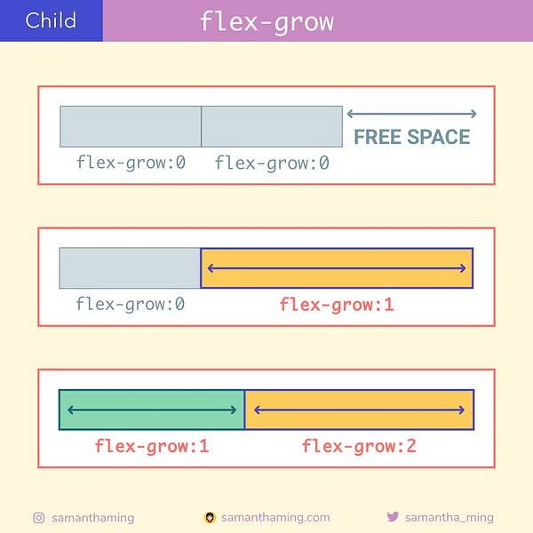
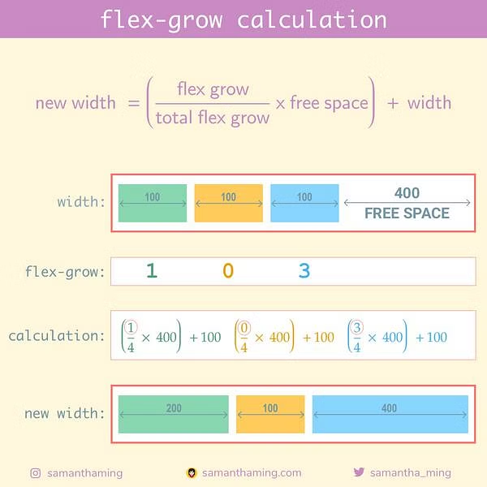
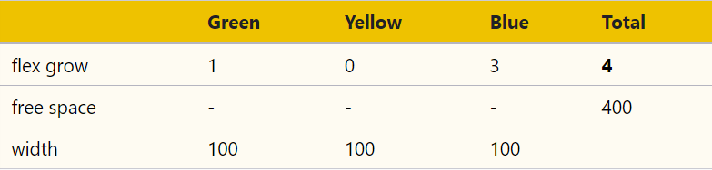
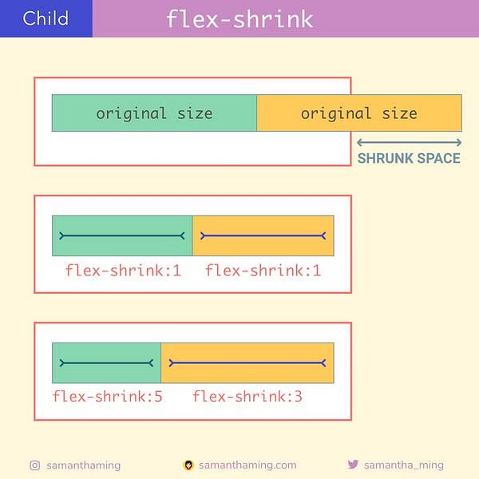
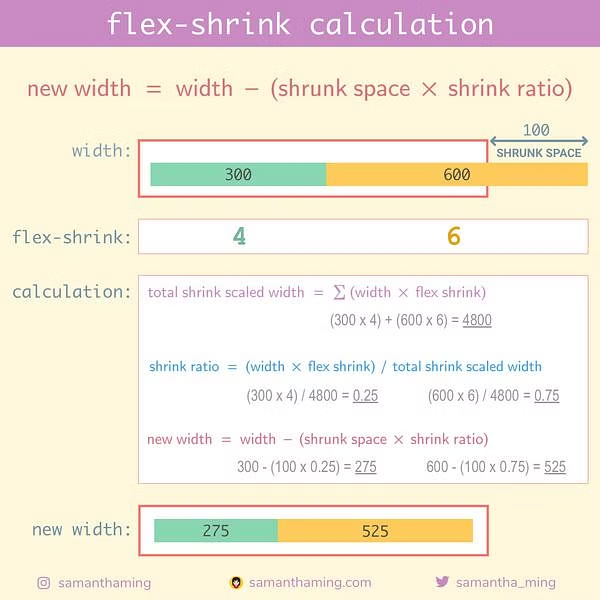

# Topic: Flex Growing and Shrinking

## [> The Odin Project  ~/lesson/foundations-growing-and-shrinking](https://www.theodinproject.com/lessons/foundations-growing-and-shrinking)

### The flex shorthand

The flex declaration is actually a shorthand for 3 properties that you can set on a flex item. These properties affect how flex items size themselves within their container.

#### Shorthand properties

These are CSS properties that let you set the values of multiple other CSS properties simultaneously.

Using a shorthand property, you can write more concise(and often more readable) stylesheets, saving time and energy.

### flex shorthands: flex-grow, flex-shrink and flex-basis

in the case of

```css
div {
    flex: 1;
}

in this case is equal to:

div {
    flex: 1 1 0;
}

where:

flex: 1             1                  0
      flex-grown    flex-shrink and    flex-basis

```

### Flex-grow

`css flex-grow` expects a single number as its value, and that number is  used as the flex item's "growth factor". When we applied `flex: 1` to every div inside our container, we were telling every div to grow the same amount. The result of this is that every div ends up the exact same size. if we instead add `flex: 2` to just one of the divs, then that div would grow to 2x the size of the others.





for this the browser calculate using the next formula:

`new width = ( (flex grow / total flex grow) x free space) + width`

then like in the image before we have:



so we can calculate like this:

```text
new width = ((1/4 * 400) + 100)
=> 200

new width = ((0/4) * 400) + 100
=> 100

new width = ((3/4) * 400) + 100
=> 400
```

### Flex-shrink

flex-shrink us similar to flex-grow, but sets the "shrink factor" of a flex item. flex-shrink only ends up being applied if the size of all flex items is larger than their parent container.

The default shrink factor is flex-shrink 1, which means all items will shrink evenly. if we do not want it to shrink we set it to 0.

An important implication to notice here is that when you specify flex-grow or flex-shrink, flex items do not necessarily respect your given values for width, if is big enough, they grow to fill it. Likewise, when the parent is too small, the default behavior is for them to shrink to fit.




where the formula to calculate this is:

`new width = width - (shrunk space x shrink ratio)`

then we calculate the shrunk space:

`shrunk space = total children widths - parent width`

where total children widths is:

`total children widths = child1 + child2`

shrink ratio
`shrink ratio = (width x flex shrink) / total shrink scaled width`

total shrink scaled width
`total shrink scaled width = Σ(width x flex shrink)`

for:

```css
.parent {
  width: 800px;
}
.green {
  width: 300px;
  flex-shrink: 4;
}
.yellow {
  width: 600px;
  flex-shrink: 6;
}
```

| value       | green | yellow |
| ----------- | :---: | :----: |
| flex shrink |   4   |   6    |
| width       |  300  |  600   |

```bash
shrunk space = total children widths - parent width
```

```bash
total children widths = green + yellow
                      = 300   + 600

=> 900
```

```bash
shrunk space = total children widths - parent width
             = 900                   -  800

=> 100
```

|              | Green | Yellow | Total |
| ------------ | :---: | :----: | :---: |
| flex shrink  |   4   |   6    |       |
| width        |  300  |  600   |       |
| shrunk space |   -   |   -    |  100  |

```bash
shrink ratio = (width x flex shrink) / total shrink scaled width
```

```bash
total shrink scaled width = Σ(width x flex shrink)
```

Green

```bash
width x flex shrink = 300 x 4

=> 1200
```

Yellow

```bash
width x flex shrink = 600 x 6

=> 3600
```

Finally

```bash
total shrink scaled width = 1200 + 3600

=> 4800
```

|                           | Green | Yellow | Total |
| ------------------------- | :---: | :----: | :---: |
| flex shrink               |   4   |   6    |       |
| width                     |  300  |  600   |       |
| shrunk space              |   -   |   -    |  100  |
| total shrink scaled width |   -   |   -    | 4800  |

```bash
shrink ratio = (width x flex shrink) / total shrink scaled width
```

Green

```bash
shrink ratio = (300 x 4) / 4800

=> 0.25
```

Yellow

```bash
shrink ratio = (600 x 6) / 4800

=> 0.75
```

|              | Green | Yellow | Total |
| ------------ | :---: | :----: | :---: |
| flex shrink  |   4   |   6    |       |
| width        |  300  |  600   |       |
| shrunk space |   -   |   -    |  100  |
| shrink ratio | 0.25  |  0.75  |       |

```bash
new width = width - (shrink space x shrink ratio)
```

Green

```bash
new width = 300 - (100 x 0.25)

=> 275
```

Yellow

```bash
new width = 600 - (100 x 0.75)

=> 525
```

|              | Green | Yellow |
| ------------ | :---: | :----: |
| width        |  300  |  600   |
| shrunk space |   4   |   6    |
| shrink ratio | 0.25  |  0.75  |
| new width    |  275  |  525   |



## Flex-basis

`flex-basis` sets the initial size of a flex item, so any sort of flex-grow or flex-shrink starts from that baseline size.

> **Note**
With `flex-shrink` if not set `flex-basis` as `auto`, the items will ignore the item's width, making all items shrink evenly.Instead if using `auto` for `flex-basis` it will tell to check for a width declaration.
Default `flex-basis` is `auto`, but using `flex: 1` change it to `flex 1 1 0`
If we need `flex-basis` in `auto`, we can use `flex: 1 1 auto` or `flex: auto`.

### Values:

`initial`
The item is sized according to its width and height properties. It shrinks to its minimum size to fit the container, but does not grow to absorb any extra free space in the flex container. This is equivalent to setting `flex: 0 1 auto`.

`auto`
The item is sized according to its width and height properties, but grows to absorb any extra free space in the flex container, and shrinks to its minimum size to fit the container. This is equivalent to setting `flex: 1 1 auto`.

`none`
The item is sized according to its width and height properties. It is fully inflexible: it neither shrinks nor grows in relation to the flex container. This is equivalent to setting `flex: 0 0 auto`.

`flex-grow`
Defines the flex-grow of the flex item. Negative values are considered invalid. Defaults to 1 when omitted. (initial is 0)

`flex-shrink`
Defines the flex-shrink of the flex item. Negative values are considered invalid. Defaults to 1 when omitted. (initial is 1)

`flex-basis`
Defines the flex-basis of the flex item. A preferred size of 0 must have a unit to avoid being interpreted as a flexibility. Defaults to 0 when omitted. (initial is auto)

## Knowledge check

- What are the 3 values defined in the shorthand flex property (e.g. flex: 1 1 auto)?
flex: 1         1           auto
      flex-grow flex-shrink flex-basis

this is equal say flex: auto

- What are the 3 defined values for the flex shorthand flex:auto?
flex: 1 1 auto

### links

- <https://www.theodinproject.com/lessons/foundations-growing-and-shrinking>
- <https://www.samanthaming.com/flexbox30/24-flex-shrink-calculation/>
- <https://developer.mozilla.org/en-US/docs/Web/CSS/flex>
