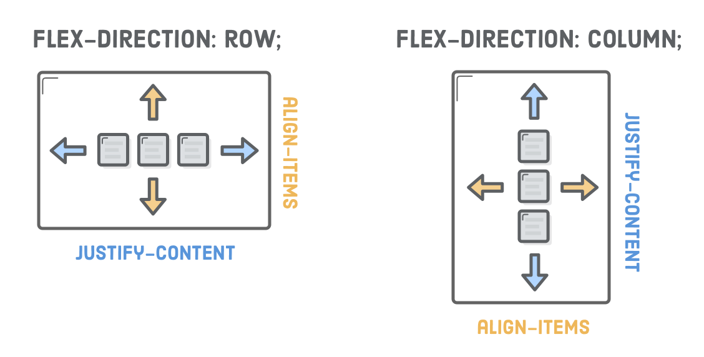

# Topic: Introduction to Flexbox

## Link: https://www.theodinproject.com/lessons/foundations-introduction-to-flexbox

- How to position elements using flexbox.
- What are flex containers and flex items.
- How to create useful components and layouts that go beyond just stacking and centering items.


### What is flexbox:
Flexbox is a way to arrange items into rows or columns. These items will flex (i.e. grow or shrink) based on some rules that you can define.

### Flex containers and flex items

Flexbox is not just a single CSS property but a whole toolbox of properties that you can use to put things where you need them. Some of these properties belong on the flex container, while some go on the flex items. 


#### Flex container:
A flex container is any element that has `display: flex` on it. The job of a flex container is to group a bunch of flex items together and define how they're positioned.

#### Flex item:
- A flex item is any element that lives directly inside of a flex container.
- Flex items can be manipulated individually, but for the most part, it's up to the container to determine their layout.
- The main purpose of flex items are to let their container know how many things it needs to position.


### Note:
- floats only let us horizontally position our boxes, flexbox gives us complete control over the alignment, direction, order, and size of our boxes.
- floats were originally intended for the magazine-style layouts.
- In the end we are dealing with boxes with nested boxes. We can align a bunch of flex items inside a container, and in turn, those items can serve as flex containers for their own items.
- 


## Default Css box model: 
This are inline, block, inline-block.


### Justify-content:
align horizontally, same effect as `margin: 0 auto;`, with this we affect all the items inside the container, only changing a property in the 'parent' element.

values:
- center
- flex-start
- flex-end
- space-around
- space-between

short hand values:
- start
- end


The space-around value spreads its items out across its entire width of the flex container automatically, distributing the extra horizontal space to either side of each item.

The space-between value is similar, but it only adds that extra space between items.


### Grouping flex items
Flex containers only know how to position elements that are one level deep (i.e., their child elements). The will ignore what is inside their flex items.


### align-items
Vertical alignment is defined by adding an align-items property to a flex container


available options:

- center
- flex-start (top)
- flex-end (bottom)
- stretch
- baseline


### Wrapping Flex items
flex-wrap property forces items that don’t fit in a set width of a container to get bumped down to the next row.


### Flex container direction
“Direction” refers to whether a container renders its items horizontally or vertically.
flexbox has the ability to transform rows into columns and bice versa using only a single line of CSS

`flex-direction: row;`
`flex-direction: column;`


### Alignment Considerations
When you rotate the direction of a container, you also rotate the direction of the `justify-content` property. It now refers to the container's vertical alignment, not its horizontal alignment.




### Flex container order
We can change the order of the boxes adding in the flex-direction the properties `row-reverse` or `column-reverse` 


### Flex item order
We can manipulate individual items using `order` property to a flex item, defining its order in the container, without affecting surrounding items. The default value is 0, and increasing or decreasing it from there moves the item to the right or left, respectively in a row.

-1 would skip the order as is less than 0.


### Flex item alignment
We can align items individually using the align-self property, this override the align-items from the container.

this accept the same values as align-items:
- center
- flex-start (top)
- flex-end (bottom)
- stretch
- baseline

### Flexible items
flex items are flexible, they can shrink and stretch to match the width of their containers.

The flex property defines the width of individual items in a flex container. Or, more accurately, it allows them to have flexible widths.

`flex: 1`


### Static Item widths
We can work with flexible or fixed width in flexbox. We can do this using the `flex: initial` value in flex. This falls back to the item's explicit width property. This lets us combine static and flexible boxes in complex layouts.

```
flex: initial;
width: 300px;
```


### Flex items and Auto-Margins
Auto-margins eat up all the extra space in the flex container, so instead of distributing items equally, this moves the item and any following item to the side of the container.
